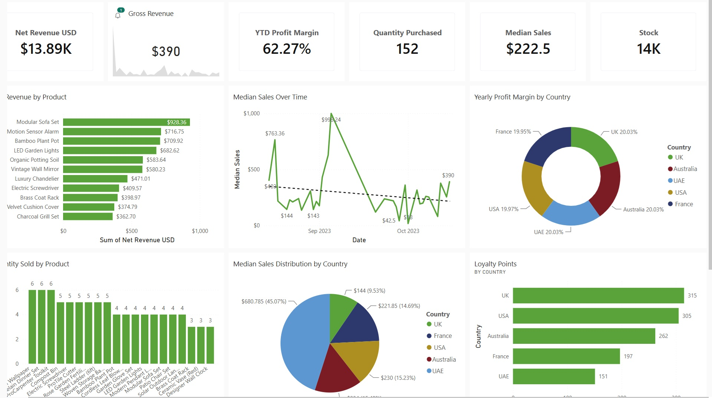

Power BI Tailwind Traders Project
# Tailwind Traders Sales & Profit Dashboard (Power BI)

## 📌 Project Overview
This project is an interactive Power BI report built using the Tailwind Traders dataset. It provides a comprehensive analysis of sales performance, revenue, and profitability across products and countries.

The report is divided into two main dashboards:
- Sales Overview
- Profit Overview

---

## 📸 Dashboard Preview

---

## 🎯 Business Objectives
- Analyze sales performance across countries and products
- Monitor key KPIs such as revenue, profit, and sales trends
- Identify high-performing products and regions
- Evaluate profit margins over time
- Support data-driven business decision-making

---

## 📊 Sales Overview Dashboard

The Sales report focuses on customer activity, product demand, and sales trends.

### Key Visuals:
- Bar Chart: Loyalty Points by Country  
- Column Chart: Quantity Sold by Product  
- Pie Chart: Median Sales Distribution by Country  
- Line Chart: Median Sales Over Time  
- KPI Cards: Stock, Quantity Purchased, Median Sales  
- Slicer: Country filter for dynamic analysis  

---

## 💰 Profit Overview Dashboard

The Profit report focuses on revenue generation and profitability insights.

### Key Visuals:
- Bar Chart: Net Revenue by Product  
- Donut Chart: Yearly Profit Margin by Country  
- Area Chart: Yearly Profit Margin Over Time  
- KPI Cards: Net Revenue, YTD Profit Margin  
- KPI Visual: Gross Revenue USD  
- Slicer: Date filter for time-based analysis  

---

## 🛠 Tools & Technologies Used
- Power BI Desktop
- Power Query (Data Cleaning & Transformation)
- DAX (Measures and KPIs)
- Data Modeling (Relationships between tables)
- Interactive Visualizations and Slicers

---

## 📁 Files Included
- `Tailwind Traders Report.pbix`
- `dashboard.png`
- `Countries.xlsx`
-  `Purchases.xlsx`
-  `Tailwind-Traders-Sales.xlsx`

## 💡 Key Business Insights
- UK and USA contribute significantly to loyalty points and revenue.
- Certain products generate higher revenue but may vary in profitability.
- Profit margins remain stable overall but show fluctuations over time.
- Sales trends highlight peak periods and potential seasonal patterns.

---

## ✅ Conclusion
This project demonstrates the ability to build interactive dashboards, analyze business performance, and present insights effectively using Power BI.

It highlights strong skills in data visualization, DAX calculations, and business analysis.
